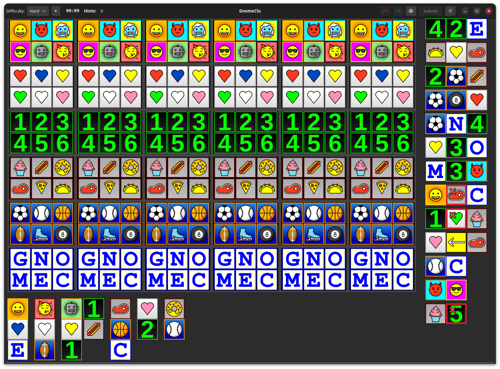

# Mind Hunt

Mind Hunt is a graphical implementation of the [Zebra Puzzle](https://en.wikipedia.org/wiki/Zebra_Puzzle), built with GTK. It runs on Linux and Windows.

# How to Play

## Video Tutorial:

(GitHub mutes audio by default, be sure to unmute sound using the video volume control)

https://github.com/user-attachments/assets/61fe3d10-efc5-4cf0-80ea-c69454759b0e

[https://github.com/user-attachments/assets/61fe3d10-efc5-4cf0-80ea-c69454759b0e](video link if GitHub player fails)

## Text Tutorial

Mind Hunt is a logical deduction style puzzle, similar to Suduko. Your goal is to find out the correct location of tiles in the puzzle grid, using deductions derived from the provided clues.

The game board is shown above as the 6x6 grid, with each cell containing six candidate tiles. The letter "O" appears bigger because it is selected; the O's are dimmed in the other cells because they've been eliminated as possibilities from other cells.

The right side of the screen contains horizontal clues, and the bottom of the screen contains vertical clues. A tooltip displays on clue mouse hover, explaining the clue.

Use the available clues to eliminates candidates from cells, until the only the solution remains. Controls:

- Left click a candidate tile to select it as the solution
- Right click a candidate tile to eliminate it as a possible solution
- Right click a clue to mark it as "done", when it has no further evidence to contribute to your board state.

## Explanation of deductions:

In harder difficulties, you'll encounter more advanced / difficult to spot deductions. They're solvable, but they may require some experience to spot. For this reason, it's recommended to learn the game on Easy, where you'll only need to perform the most basic deductions.

- Standard - tile cannot be in a location, because the clue cannot be satisfied with it. For example, above, the red heart can only go in column 6 and column 4, because the first horizontal clue says it is next to the O.
- Hidden pair - Similar to Suduko, when a set of tiles can only go in an equally sized set of cells, then you may eliminate those tiles from all other cells. For example, if "2" and "4" were the only candidates in column 1 and 2, then you'd eliminate "2" and "4" from columns 3-6.
- Converging solutions - If all possible solutions for a clue converge on to a single tile, then that tile can only contain the tiles from the potential solutions that target the clue. For example, if the donut could only be in columns 1 and 5, then we'd know that column 3 must contain the "N", because of the second horizontal clue.
- Contradicting solutions - If selecting a tile would create a board state where a clue could not be satisfied, then the tile can be eliminated from that column. For example, if "4" and "6" could only go in column 2, then "4" and "6" could be eliminated from columns 3-6, because of horizontal clue number 3.

# Backgound

Mind Hunt takes pretty heavy inspiration by [Everett Kaser's Sherlock](https://www.kaser.com/home.html). The creator of this game has played 1,000s of hours of Everett's game over the decades. My grandparents played Kaser's game, my parents still play it, and so do I.

Current differences:

- Puzzle generator
  - Puzzle generator more reliably generates difficult puzzles, with "veteran" difficulty puzzles taking experienced solvers about 1 hour to solve.
  - Puzzles often require advanced deductions such as converging solutions, hidden pair, and contradicting solution deductions.
  - Puzzle variety system which guides the generator using heuristics to change the overall deduction pattern themes.
- More subtle clue system which nudges the user where to look, with incremental help.
- A stupid amount of possible puzzles... 18,446,744,073,709,551,615 of them.

Planned differences:

- Experimental new clue types.
- Competition mode (two users playing the same puzzle, racing on time).

If you enjoy this game, please buy Everett's mobile version for your phone / iPad. He's a smart guy and it's worth your money. Also, check out his other puzzle games.

There are no plans to make a mobile version of Mind Hunt.

# Credits Etc

- [https://openmoji.org/] - OpenMoji provided the glyphs used for the tile set.
- [https://github.com/gtk-rs/gtk4-rs] - gtk4-rs for the amazing Rust GTK bindings
- [https://www.gnome.org/] - Gnome, for GTK.
- [https://www.youtube.com/user/Davie504] - Davie504, for the win/lose sounds. Pls don't sue thx.

# Building

Mind Hunt is built with Rust and GTK4+. You should install a modern version of Rust using `rustup`.

## Notes on windows build

- need packages `gcc-mingw-w64`, `mingw-w64`, `nsis` (nullsoft installer), and some dev deps probably.
- Download gtk for windows, extract to `./bundle/gtk`
- Download VulkanRT-{ver}-Components.zip; extract to `./bundle/vulkan`
  - Maybe need to install SDK for windows and copy this? IDK. I did it but the file seems to be in VulkanRT components. `~/.wine-affinity/drive_c/windows/system32/vulkan-1.dll` to `./bundle/gtk/lib/vulkan-1.dll`
- run `./config-windows.sh` to finish setting up the files and editing paths in the package conf files.

- run `make windows`.

## Linux build

`make linux` oughta do it. You'll probably get yelled at for some missing dev dependencies. Install them, repeat until success. You can do it. I believe in you.

## Mac OS build

While GTK has access to Apple computers, the author of this game does not. If someone wants to help here, have a look at https://docs.gtk.org/gtk4/osx.html; You'll probably want to make a fat binary and bundle a build of GTK as is done for the Windows port.
